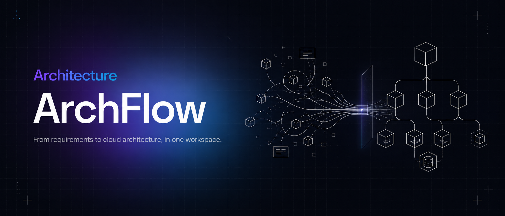

  

Describe what you want to build, or upload your existing requirements doc.
ArchFlow turns either starting point into an editable AWS architecture diagram
and governed infrastructure code.

---

## What it does

ArchFlow is an AI-native workspace that closes the loop between a requirements
document and a running AWS architecture:

1. **Upload or describe** — drop a BRD/spec, or just describe the system in chat.
2. **Extract requirements** — an ETL pipeline parses documents (including embedded
   diagrams) into evidence-backed structured requirements, with a human
   confirmation step for anything ambiguous.
3. **Generate the architecture** — an LLM agent designs an AWS architecture graph;
   an independent Architect Reviewer agent can critique and refine it.
4. **Render & edit** — the graph is laid out deterministically (ELK, no LLM in the
   loop for geometry) onto an interactive canvas, plus a real embedded draw.io
   editor for hand edits.
5. **Generate IaC** — Terraform / CDK / CloudFormation is generated from the same
   graph, streamed file-by-file, with a self-healing `terraform validate` repair
   loop for Terraform output.

Every generation step streams live progress into the chat — designing the graph,
validating it, reviewing it, laying it out, writing each IaC file — instead of a
single opaque "please wait."

## Repositories

| Repo | Stack | Role |
|---|---|---|
| [**archflow-agent**](https://github.com/ArchFlow-AI/archflow-agent) | TypeScript, [Mastra](https://mastra.ai) | AI agent backend: document ETL, architecture-graph generation, deterministic diagram rendering, cost estimation, IaC generation. Exposed to the frontend over CopilotKit / AG-UI. |
| [**archflow-app**](https://github.com/ArchFlow-AI/archflow-app) | Next.js 16 (App Router), React 19, Prisma/Postgres | Frontend workspace: upload → chat → draw.io canvas + embedded VS Code (code-server) panel. Owns auth (Cognito), sessions, and persistence. |
| [**archflow-tf**](https://github.com/ArchFlow-AI/archflow-tf) | Terraform | AWS infrastructure: VPC, ECS Fargate, ALB, CloudFront, Cognito, S3, ECR, EFS. |

## How it's built

- **Agent orchestration** — [Mastra](https://mastra.ai) agents, tools, and workflows, with per-user/per-thread memory scoping.
- **Live streaming UI** — the [AG-UI protocol](https://github.com/ag-ui-protocol/ag-ui) plus a custom in-process progress bridge, so every tool call and workflow step shows up in the chat as it happens — not just when it finishes.
- **Chat surface** — [CopilotKit](https://www.copilotkit.ai/) for the conversational workspace, with custom activity-card renderers for diagram and IaC generation.
- **Diagrams** — deterministic layout via [ELK](https://www.eclipse.org/elk/) (the model only decides architecture *semantics*, never geometry), rendered on an interactive React Flow canvas, plus a real embedded [draw.io](https://www.drawio.com/) editor with authentic AWS icon shapes.
- **Models** — Amazon Bedrock (Claude), with model choice tuned per task — a fast/cheap model for interactive diagram chat, a stronger model for structured IaC generation and architecture review.
- **Infrastructure** — AWS: ECS Fargate, CloudFront, Cognito, S3, EFS, provisioned with Terraform.

